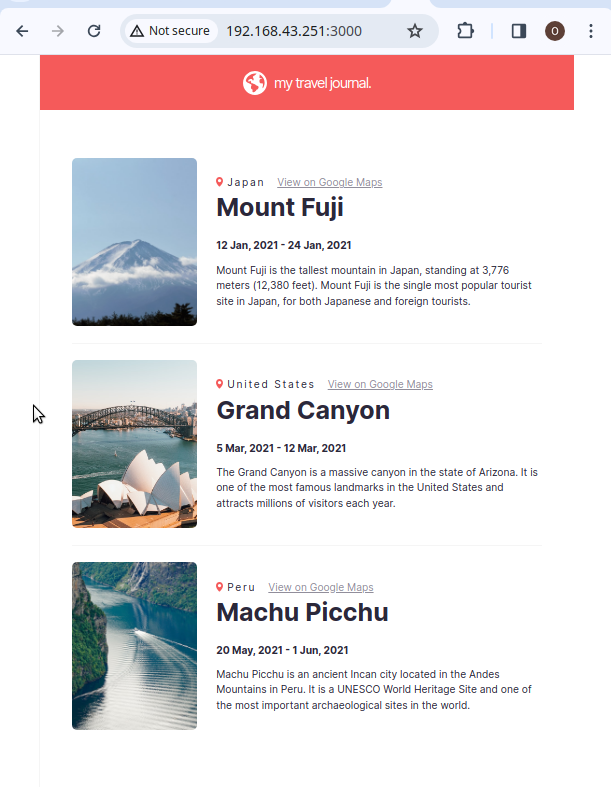

# Travel Journal

<div align="center">


 </div>


This small react project provided opportunity to learn basic react concepts which include:

- Custom components
- JSX
- CSS styling
- Props - reusable and composable components
    - How to pass props to components
    - How to consume props
- Dynamically render components from external data


## File structure
```
│
    ├── public                   # public files (favicon, index.html)
    ├── src                      # source files
    │   ├── components/
    │   ├── styles/              # css for each components
    │   ├── assets/              # images
    │   ├── index.js
    |   |── index.html
    |   ├── index.css
    |
    ├── .gitignore
    ├── package.json
    ├── README.md
    └── package.json
```
